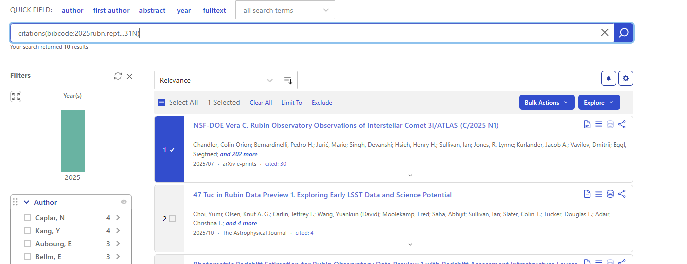
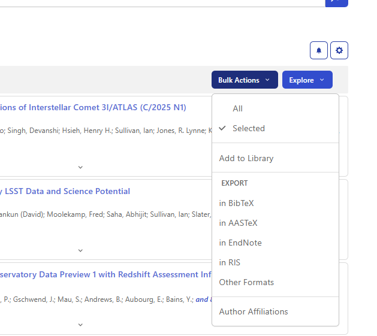
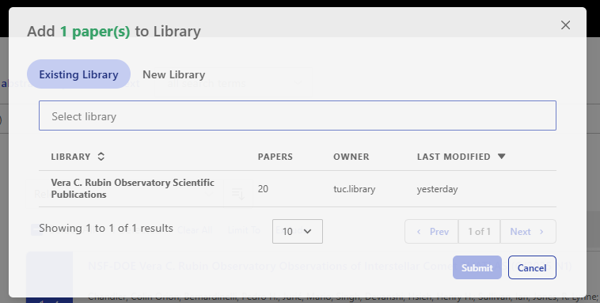
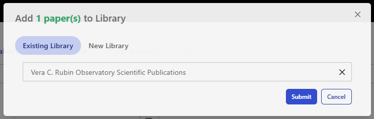

######################
Curated SciX Libraries
######################

.. abstract::

   Technical note describing the process for maintaining the Rubin Observatory technical and scientific libraries in the Science Explorer (SciX) digital library portal.

========
Overview
========

Tracking scientific publications is essential for demonstrating the scholarly impact of Rubin Observatory’s data products, analysis tools, and
technical contributions to the astronomical community. The Community Science Team (CST) monitors research that uses Rubin Observatory data or
tools and curates public libraries of relevant publications on the `Science Explorer (SciX) digital library portal <https://scixplorer.org/>`_ for researchers in astronomy.
The number of scientific and technical papers published with Rubin data is an essential metric tracked and reported to Rubin and agency management.
These curated libraries are linked from the `Rubin Observatory For Scientists website <https://rubinobservatory.org/for-scientists>`_.

This document outlines the process used for maintaining these libraries. It explains the structure and purpose of each library,
the search strategies employed to identify relevant publications, the workflow for reviewing and adding papers, and the criteria for inclusion or exclusion.
It also describes how publication metrics are compiled and reported annually.

**Note**: If anyone from the broader Rubin community notices their paper is missing and would like it added to the library,
they should post in the `Rubin Community Forum Support category <https://community.lsst.org/c/support/6>`_
and request a review.

====================
Rubin SciX libraries
====================

Rubin maintains two distinct public libraries within SciX: one for scientific publications and one for technical publications. 
Each serves a unique purpose in documenting how Rubin’s resources are used.

The Rubin Observatory Scientific Publications Library includes refereed papers that directly references Rubin Observatory data products, select technical documentation,
and non-refereed papers such as arxiv preprints and research notices. As Rubin’s data offerings expand, the search criteria for this library will evolve. 

- Public library name: `Vera C. Rubin Observatory Scientific Publications <https://scixplorer.org/public-libraries/QQ9rNp-QSZqea5vG6zESUQ>`_
- Search query for library: docs(library/QQ9rNp-QSZqea5vG6zESUQ)

The Rubin Observatory Technical Publications Library focuses on Rubin’s internal and external technical outputs, such as software documentation, system design papers, and engineering reports.
These materials are essential for understanding the infrastructure that supports Rubin’s scientific mission.

- Public library name: `Vera C. Rubin Observatory Technical Publications <https://scixplorer.org/public-libraries/oue8xvvpTjqeYPvR5YW6VA>`_
- Search query for library: docs(library/oue8xvvpTjqeYPvR5YW6VA)

======================================
Scientific library maintenance process
======================================

To capture as many relevant papers as possible, the CST designs search queries based on SciX bibcodes for Rubin data release technical documentation and data products.
Each bibcode uniquely identifies a Rubin publication or dataset within SciX. Although search results may include a wide range of papers,
only those that meet the defined inclusion criteria are added to the library.
By reviewing bibcode-based search results on a regular basis, the CST ensures that the library remains accurate and up to date with the appropriate scientific literature.
In addition to bibcode-based queries, the CST also conducts keyword and timeframe searches to ensure that any relevant papers are identified and added to the scientific library.

Perform search
--------------

SciX allows searches in specific fields, including keywords, bibcodes, titles, and Digital Object Identifiers (DOIs).

Appendix A provides pre‑built links focused on Rubin’s data release technical documentation, data products, and time‑constrained keywords.
Users may either click the links directly or enter the corresponding criteria from the table into the SciX search bar to retrieve papers citing the specified bibcode or keyword.
In many cases, including non-refereed results (e.g., arXiv preprints) is useful for identifying recent or in-progress work.
For broad or high-volume queries, such as the Rubin Observatory keyword search,
restricting results to refereed papers and applying a defined publication time-frame filters out records outside the intended scope,
limits the number of returned records, and improves the efficiency of the review process.
Appendix A searches are structured to reflect this distinction.

If a new query is needed, the `SciX help pages <https://scixplorer.org/scixhelp/>`_ and Appendix B provide instructions for constructing one.

Review papers for inclusion
---------------------------

Once the search results are displayed, each paper must be reviewed to determine whether it meets the inclusion criteria.
This involves examining the title, abstract, and sometimes the full text to assess whether Rubin Observatory data or services were substantively used.

A paper is eligible for inclusion if it meets the following conditions:

- It presents a scientific analysis based, in whole or in part, on Rubin Observatory data services and data products, such as data releases (e.g., DP0, DP1, DP2, DR1, and so on).
- It is a refereed journal article or a non-refereed publication deemed appropriate for the library (e.g., technical documentation, arXiv preprint, research notice.)

Exclusion criteria
------------------

We exclude the papers that have the following parameters:

- It is not a scientific analysis based on Rubin data products.
- It uses only mock catalogs, simulations, or LSST design parameters without incorporating Rubin data.
- It mentions Rubin Observatory only in passing, such as in the background/introduction, acknowledgments, or future work sections.
- It uses Rubin images solely for illustrative purposes without scientific analysis.
- It is a proposal, abstract, or erratum.
- It focuses solely on technical or software development without application to any Rubin data products (the paper is eligible for the technical publications list if it is produced by Rubin Observatory).

Adding a paper to the Vera C. Rubin Scientific Publications library
-------------------------------------------------------------------

The process for adding a paper to the Scientific Publications Library is as follows:

1. Perform the relevant search from links provided in Appendix A.
2. Review the papers and decide on papers to include in the library.
3. Select paper(s) by checking the box next to the paper (Figure 1).
4. Click "Bulk Actions" and select "Add to Library" from the dropdown menu (Figure 2).
5. Click within the "Select Library" bar and select “Vera C. Rubin Observatory Scientific Publications” (Figure 3).
6. Click “Submit” to complete the process (Figure 4).

   Select paper(s) from search results by checking box next to paper entry.

   Click Bulk Actions and select “Add to Library” from downdown menu.

   Click within the Select Library bar and select “Vera C. Rubin Observatory Scientific Publications” library.

   Click “Submit” to complete the process.

Reporting
---------

The curated scientific library currently lists the total number of papers added that meet established criteria for relevance and quality.

To compile the annual CST reporting metrics:

- Click on the relevant library link Vera C. Rubin Observatory Scientific Publications, Vera C. Rubin Technical Publications.
- Click on "View as search results".
- Filter the SciX public library for fiscal year(s) by clicking on "All Search Terms" above the search bar and selecting "Date Published" from the dropdown menu or typing in the field operator "pubdate:" as shown in the example below.  For fiscal years, input the dates in the following format: 2025-10 TO 2026-09 (October 1 through September 30). Example: docs(library/QQ9rNp-QSZqea5vG6zESUQ) AND pubdate:[2025-10 TO 2026-09]
- Select for refereed papers by clicking on the Refereed button on the left side and selecting "refereed" then "limit to".
- Note the number of search results and report into the appropriate annual report.

Future enhancements to this process and CST annual report metrics may include categorization of publications by type and monitoring the pace of additions over time.

=====================================
Technical library maintenance process
=====================================

Technical publications are currently identified through Publication Board submissions and periodic manual searches of common venues such as SPIE and ADASS.
This reflects existing practice and will be refined as additional automation or notification mechanisms become available.

==============================
Appendix A SciX search queries
==============================

This appendix provides a reference list of Rubin Observatory resources, such as technical publications and data releases,
that are commonly cited in scientific literature.
Each entry includes its SciX bibcode and a sample search query to help identify relevant publications for inclusion in the Rubin Scientific Publications Library.

Additional searches will be included in this list as new technical notes and datasets become available. 

**NOTE - After performing the search, click the refereed checkbox on the left side to review refereed papers only.
While it is possible to construct the search which will return refereed papers, it was determined that the extra step of selecting only refereed papers provided more flexibility.**

.. list-table:: SciX search queries
   :header-rows: 1
   :widths: 20 20 15 45

   * - Bibcode and Link to SciX query
     - Title
     - Type
     - SciX Search Query

   * - `2025rubn.rept...31N <https://scixplorer.org/search?n=10&p=1&q=citations(bibcode%3A2025rubn.rept...31N)&sort=score+desc&sort=date+desc>`_
     - RTN-095, The Vera C. Rubin Observatory Data Preview 1
     - Technical note
     - citations(bibcode:2025rubn.rept...31N)

   * - `2025lsst.data....3N <https://scixplorer.org/search?n=10&p=1&q=citations(bibcode%3A2025lsst.data....3N)&sort=score+desc&sort=date+desc>`_
     - Legacy Survey of Space and Time (LSST) Data Preview 1
     - Dataset
     - citations(bibcode:2025lsst.data....3N)

   * - `Rubin Observatory AND pubdate:["2026-01-31" TO "2026-02-28"] AND property:refereed <https://scixplorer.org/search?d=general&n=10&p=1&q=Rubin+Observatory+AND+pubdate%3A%5B%222026-01-31%22+TO+%222026-02-28%22%5D+AND+property%3Arefereed&sort=date+desc>`_
     - Rubin Observatory and Month **(Note: alter dates as appropriate)**
     - Phrase search and Month
     - Rubin Observatory AND pubdate:["2025-12-31" TO "2026-01"] AND propertry:refereed

   * - `Rubin Data Preview 1 AND year:2026 <https://scixplorer.org/search?d=general&n=10&p=1&q=Rubin+Data+Preview+1+AND+year%3A2026&sort=score+desc&sort=date+desc>`_
     - Rubin Data Preview 1
     - Phrase search and year
     - Rubin Data Preview 1 AND year:2026

   * - `LSST Data Preview 1 AND year:2026 <https://scixplorer.org/search?d=general&n=10&p=1&q=LSST+Data+Preview+1+AND+year%3A2026&sort=score+desc&sort=date+desc>`_
     - LSST Data Preview 1
     - Phrase and year search
     - LSST Data Preview 1 AND year:2026

   * - `Rubin Data Preview 0 AND year:2026 <https://scixplorer.org/search?d=general&n=10&p=1&q=Rubin+Data+Preview+0+AND+year%3A2026&sort=score+desc&sort=date+desc>`_
     - Rubin Data Preview 0
     - Phrase and year search
     - Rubin Data Preview 0 AND year:2026

   * - `LSST Data Preview 0 AND year:2026 <https://scixplorer.org/search?d=general&n=10&p=1&q=LSST+Data+Preview+0+AND+year%3A2026&sort=score+desc&sort=date+desc>`_
     - LSST Data Preview 0
     - Phrase and year search
     - LSST Data Preview 0 AND year:2026

===============================
Appendix B Creating new queries
===============================

As Rubin Observatory releases new data or technical notes, additional search criteria may be needed. Construct effective queries using the SciX Help web pages or the following basic guidelines:

- To find bibcodes:

  - Review DOI for data releases.  Search for the data release DOI in SciX and the bibcode is listed underneath: for example, in the search box, use  **10.71929/rubin/2570308**.
  - Review DOI or bibcode for technical notes or publications. Search for and find bibcodes technical papers: for example, in the search box, use **(title:”RTN-095”)**.

- To refine search for a specific time-frame:

  - For annual reviews: use **year:2026**
  - For rolling updates: use **year:2025 or year:2024**
  - For more specific date criteria: use **date:[2025-01 to 2025-12]**

- To construct a search based on a bibcode: use **citations(bibcode: XXX)**
- To use a bibcode with specific time-frame: use **citations(bibcode:XXX) AND year:2026**
- To search for multiple bibcodes: use **citations(bibcode:XXX OR bibcode:YYY)**
- To search with keywords and a time-frame: use **(title:”XXX” OR abstract:”YYY”) AND year:2026**

